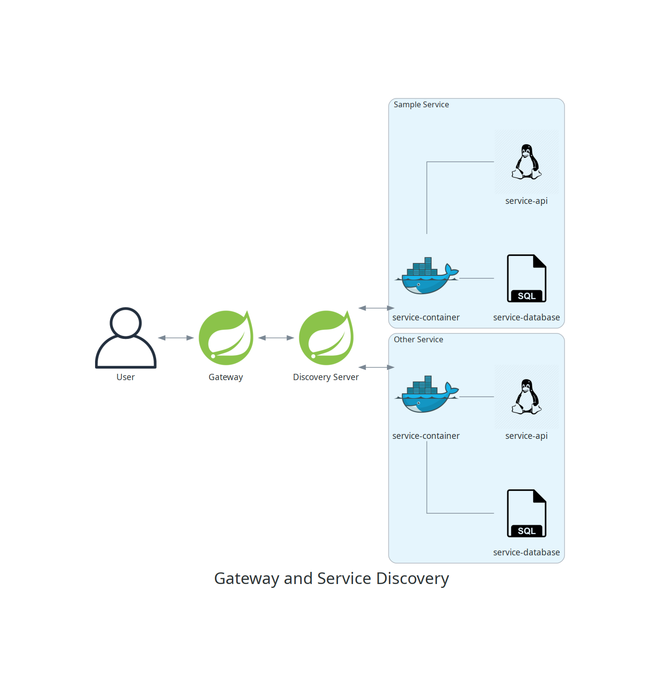

# Back-end Structure/Architecture

This project uses the [Microservice Architecture](https://en.wikipedia.org/wiki/Microservices).

_This is a live document. It will change from time to time._

This project has small, autonomous containers with different services and databases working together to form a whole application. These services communicate by registering to a server service that handles all services' IP addresses and ports. If the project needs to be scaled, it's possible to scale only the microservices that require extra power. The front-end (user) connects to a gateway that connects to the service discovery server, and every request goes to its respective service.

Services request the service discovery server for other services' information (IP address, port) when they communicate with each other, just like when users make a request.

## Notifications

In this example, a user replies to another users' post. After handling the reply logic, the `Posts Service` fires an event warning the `Notification Service` to show the post creator a notification.

