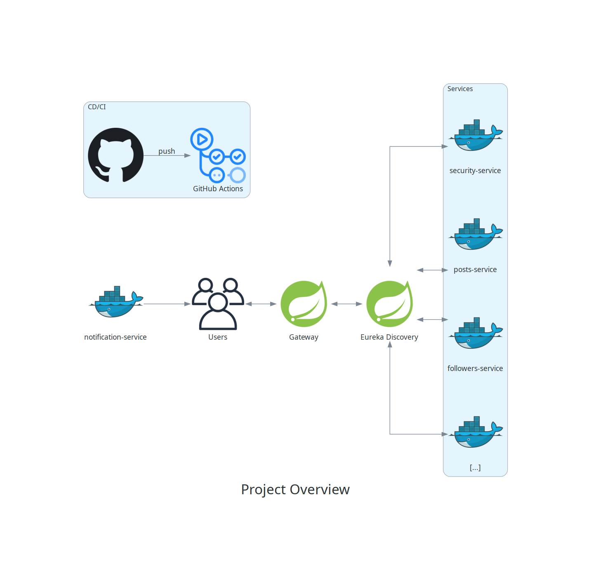

# Project Overview

_This is a simple document. A longer, more detailed version of this project's specifications will be created at another time._

_This is also a live document. It will change from time to time._

_You can download this file as PDF [by clicking here](https://pauloelienay.com/signals/SPECIFICATIONS.pdf)_.

## What is `Signals`?

Signals is an open-source live-sharing character-limited-posting social media. It aims to have the same functionalities as Twitter.

## Back-end structure

This project uses the [Microservice Architecture](https://en.wikipedia.org/wiki/Microservices).

## Front-end and UI/UX

This project will try to get close to the Twitter UI/UX. The goal of the front-end is to be user-friendly and have as little migration friction as possible.

## Goals

The goal of this project is to have a full fullstack project -- with many of today's most talked-about technologies -- made open-source for my own learning and the learning of others.
